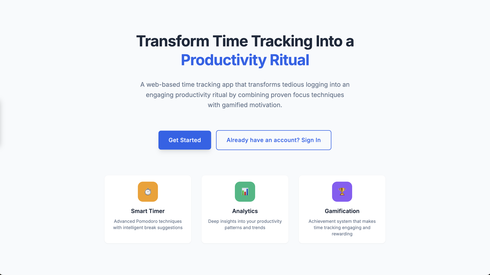
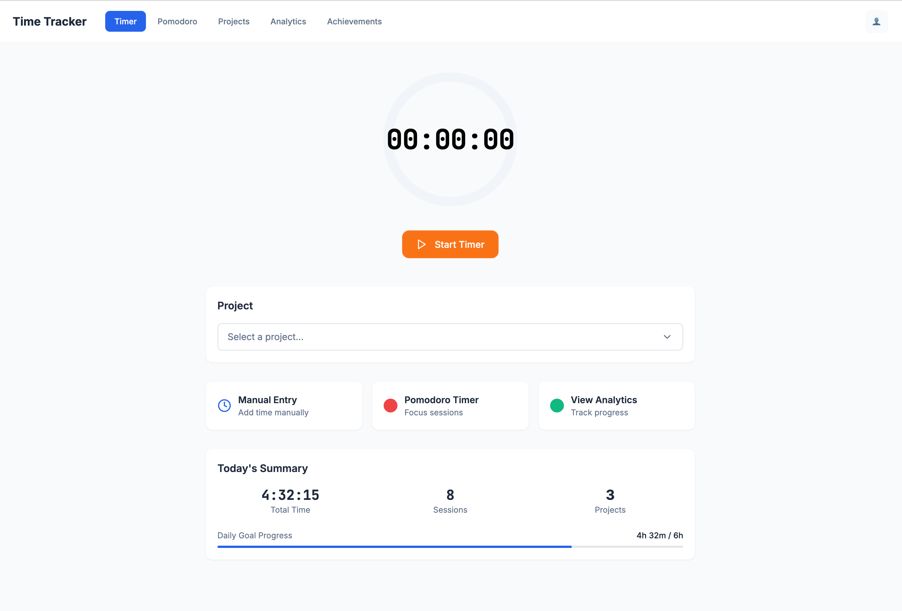
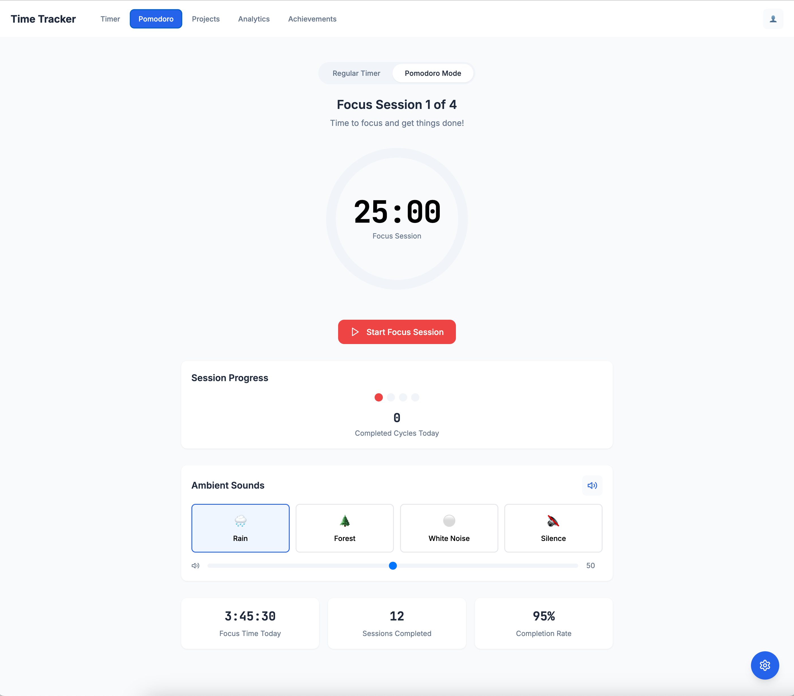
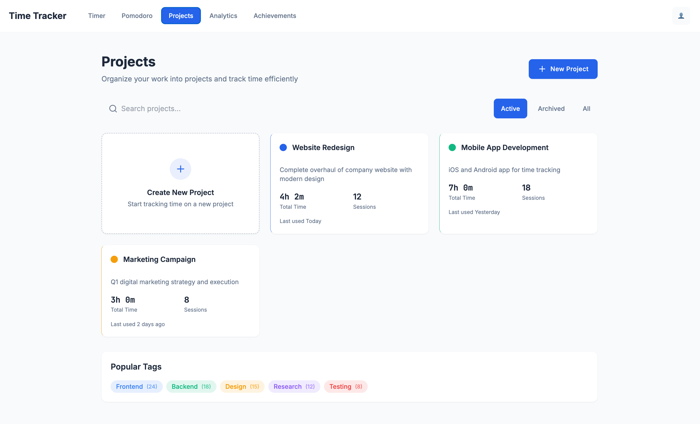
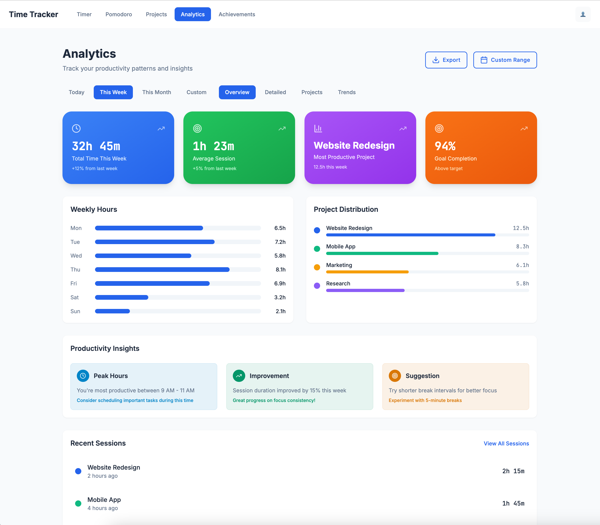

# ⏰ Professional Time Tracker

A comprehensive time tracking application built with React, TypeScript, and Tailwind CSS. Features include project management, Pomodoro timer, analytics dashboard, and achievement system.


## 🚀 Features

### 🎯 Core Features
- **Real-time Timer**: Track work sessions with manual or automatic timing
- **Project Management**: Organize tasks by projects with color coding
- **Pomodoro Timer**: Built-in Pomodoro technique with customizable intervals
- **Analytics Dashboard**: Detailed insights and productivity metrics
- **Achievement System**: Gamification with badges and progress tracking
- **User Authentication**: Secure login and registration system

### 💡 Advanced Features
- **Dark/Light Theme**: Toggle between professional themes
- **Time Goals**: Set and track daily/weekly objectives
- **Export Data**: Download reports in multiple formats
- **Ambient Sounds**: Focus-enhancing background audio
- **Break Reminders**: Smart notifications for healthy work habits
- **Productivity Insights**: AI-powered productivity recommendations

## 📱 Screenshots

### Core Application Views

*Landing page with authentication modals*


*Main timer interface with project selection*


*Pomodoro timer with customizable intervals*


*Project management dashboard*


*Analytics and productivity insights*

## 🛠️ Tech Stack

### Frontend
- **React 18** - Modern React with hooks and functional components
- **TypeScript** - Type-safe development
- **Tailwind CSS** - Utility-first CSS framework
- **Lucide React** - Beautiful, customizable icons
- **Vite** - Fast development and build tool

### Development Tools
- **ESLint** - Code linting and quality
- **PostCSS** - CSS processing
- **Autoprefixer** - CSS vendor prefixing

## 🚀 Getting Started

### Prerequisites
- Node.js 16+ 
- npm or yarn package manager

### Installation

1. **Clone the repository**
   ```bash
   git clone https://github.com/TronTram/TimeTrackerUI.git
   cd TimeTrackerUI
   ```

2. **Install dependencies**
   ```bash
   npm install
   ```

3. **Start development server**
   ```bash
   npm run dev
   ```

4. **Open in browser**
   Navigate to `http://localhost:5173`

### Build for Production

```bash
# Build the application
npm run build

# Preview production build
npm run preview
```

## 📁 Project Structure

```
src/
├── screens/
│   ├── LandingScreen.tsx      # Authentication & landing page
│   ├── TimerDashboard.tsx     # Main timer interface
│   ├── PomodoroTimer.tsx      # Pomodoro functionality
│   ├── ProjectManagement.tsx  # Project CRUD operations
│   ├── Analytics.tsx          # Analytics dashboard
│   └── AchievementHub.tsx     # Gamification system
├── App.tsx                    # Main application component
├── main.tsx                   # Application entry point
└── index.css                  # Global styles & Tailwind
```

## 🎨 Design System

### Color Palette
- **Primary**: `#3B82F6` (Blue)
- **Secondary**: `#8B5CF6` (Purple) 
- **Success**: `#10B981` (Green)
- **Warning**: `#F59E0B` (Amber)
- **Error**: `#EF4444` (Red)

### Typography
- **Headings**: Inter font family
- **Body**: System font stack
- **Code**: Monospace fonts

### Components
- Custom button variants (primary, secondary, large)
- Consistent spacing and border radius
- Responsive design patterns

## 🔧 Configuration

### Environment Variables
Create a `.env.local` file for local development:
```env
VITE_API_URL=http://localhost:3001
VITE_APP_NAME=Professional Time Tracker
```

### Tailwind Configuration
The app uses a custom Tailwind configuration with:
- Extended color palette
- Custom component classes
- Responsive breakpoints
- Animation utilities

## 📊 Features Breakdown

### Timer Dashboard
- Real-time timer with start/stop/pause
- Project selection and task naming
- Manual time entry capabilities
- Recent activity tracking

### Pomodoro Timer
- Customizable work/break intervals
- Visual progress indicators
- Ambient sound options
- Session statistics

### Project Management
- Create, edit, delete projects
- Color-coded organization
- Search and filter capabilities
- Time allocation tracking

### Analytics
- Daily, weekly, monthly views
- Productivity trends and insights
- Time distribution charts
- Goal progress tracking

### Achievement System
- Badge collection system
- Streak tracking
- Progress milestones
- Gamification elements

## 🤝 Contributing

1. Fork the repository
2. Create a feature branch (`git checkout -b feature/amazing-feature`)
3. Commit your changes (`git commit -m 'Add amazing feature'`)
4. Push to the branch (`git push origin feature/amazing-feature`)
5. Open a Pull Request

## 📝 License

This project is licensed under the MIT License - see the [LICENSE](LICENSE) file for details.

## 🙏 Acknowledgments

- Design inspiration from modern productivity apps
- Icons provided by [Lucide React](https://lucide.dev/)
- Built with [Vite](https://vitejs.dev/) and [Tailwind CSS](https://tailwindcss.com/)

## 📞 Support

For questions and support:
- Create an issue on GitHub
- Email: support@timetracker.com
- Documentation: [Wiki](https://github.com/TronTram/TimeTrackerUI/wiki)

---

**Built with ❤️ by the Time Tracker Team**
